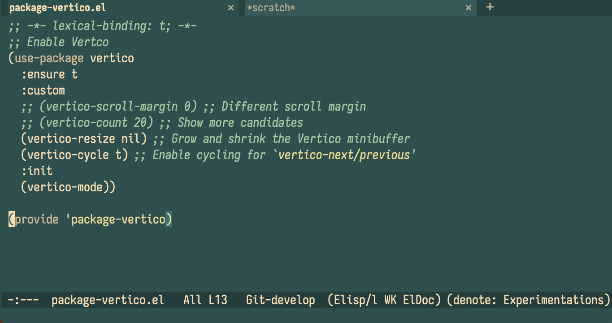

# nostalgy-theme

A dark Emacs theme that revives the palette of the early graphical web and the
X11 `rgb.txt` colour list: a `DarkSlateGray` canvas, `wheat` text, sea greens,
burlywood, and a jolt of pure `cyan` for links and strings.




The internal architecture follows the [Modus
themes](https://protesilaos.com/emacs/modus-themes) by Protesilaos Stavrou:

1. a palette of **named colours** — `(wheat "#f5deb3")`
2. a layer of **semantic mappings** — `(string cyan-cooler)`, `(comment green-faint)`

A mapping value may be a hex string, the name of another palette colour, or the
name of another mapping (resolved recursively).

## Install

Put `nostalgy-theme.el` on your `custom-theme-load-path`, then:

```elisp
(load-theme 'nostalgy :no-confirm)
```

With `use-package` and a local file:

```elisp
(use-package nostalgy-theme
  :load-path "~/path/to/emacs-nostalgy-theme"
  :config (load-theme 'nostalgy :no-confirm))
```

## Two moods

**Default (understated).** Most code stays `wheat`; `cyan` is reserved for
strings and links, comments are a quiet sea-green. Mirrors the minimalist
reference screenshot.

**Colourful.** Keywords, types, constants and functions get their own hues,
matching the busier `nostalgia.png` reference. Enable it before loading:

```elisp
(setq nostalgy-palette-overrides nostalgy-preset-overrides-colorful)
(load-theme 'nostalgy :no-confirm)
```

## Typography

The theme is colour-only: it sets no bold weights and no `:height` scaling
anywhere (headings included). Distinctions are carried by hue alone. Add your
own emphasis with `custom-set-faces` if you want it.

## Customisation

Shadow any palette entry — a named colour or a semantic mapping — via
`nostalgy-palette-overrides`:

```elisp
(setq nostalgy-palette-overrides
      '((bg-main "#294545")          ; darker canvas
        (comment green-cooler)       ; point a mapping at another colour
        (string  "#7fffd4")))        ; Aquamarine strings
```

Retrieve a resolved value in your own code:

```elisp
(nostalgy-get-color-value 'fg-heading-1)
```

or run code with every palette entry bound as a lexical variable:

```elisp
(nostalgy-with-colors
  (set-face-attribute 'my-face nil :foreground cyan-cooler :background bg-dim))
```

`nostalgy-after-load-theme-hook` runs after the theme is loaded.

## Palette overview

| Role        | Colour            | Hex        |
|-------------|-------------------|------------|
| background  | `DarkSlateGray`   | `#2f4f4f`  |
| foreground  | `wheat`           | `#f5deb3`  |
| strings     | toned cyan        | `#4fd0d0`  |
| links       | `cyan` / aqua     | `#00ffff`  |
| comments    | soft sea-green    | `#a6c3a0`  |
| types       | `DarkSeaGreen`    | `#8fbc8f`  |
| keywords    | faint wheat/gold  | `#cdba96`  |
| constants   | pale gold         | `#e8d994`  |
| warnings    | gold              | `#e8d994`  |
| errors      | `DarkSalmon`      | `#e9967a`  |
| success     | `MediumSeaGreen`  | `#3cb371`  |

## Coverage

Core faces, `font-lock` (incl. Emacs 29+ faces), `isearch`/`occur`,
`show-paren`, line numbers, mode line, `tab-bar`/`tab-line`, the built-in
completion UI plus `orderless`, `vertico`, `marginalia`, `consult`, `corfu`,
`company`, `which-key`, `dired`, `diff-mode`, `ediff`, `magit`, `smerge`,
`git-gutter`/`diff-hl`, `flymake`/`flycheck`/`flyspell`, `compilation`,
`eshell`/`term`/`ansi-color`, `org` (agenda included), `outline`, `markdown`,
`whitespace-mode`, `rainbow-delimiters`, `hl-todo`, widgets/`customize`,
`info`, and `message`/`gnus` essentials.

## Ports

The same palette is available for two more tools, so the terminal side of
your setup matches Emacs:

- **[WezTerm](wezterm/)** — `wezterm/nostalgy.toml`
- **[Midnight Commander](mc/)** — `mc/nostalgy.ini`

### WezTerm

```sh
mkdir -p ~/.config/wezterm/colors
cp wezterm/nostalgy.toml ~/.config/wezterm/colors/
```

```lua
-- wezterm.lua
config.color_scheme = 'Nostalgy'
```

That covers the terminal grid, cursor, selection, scrollbar, split lines
and the `copy_mode`/`quick_select` overlays.

**Tab bar and window frame.** A colour-scheme file cannot style them.
The default *fancy* tab bar and the frame around it are driven by
`window_frame`, which only exists in Lua — so `wezterm/nostalgy.lua`
carries that piece:

```lua
local wezterm = require 'wezterm'
local config = wezterm.config_builder()

-- point Lua at wherever you cloned this repo
package.path = wezterm.home_dir
  .. '/src/emacs-nostalgy-theme/wezterm/?.lua;' .. package.path

require('nostalgy').apply(config)          -- scheme + window_frame + tabs
-- require('nostalgy').apply(config, { retro_tab_bar = true })  -- classic text tabs

return config
```

`apply` sets `color_scheme`, the `window_frame` colours (title bar, its
border, the `+`/`x` buttons) and the per-tab colours. Pass
`{ retro_tab_bar = true }` to switch off the fancy bar and get the full
palette rendered in text cells.

### Midnight Commander

```sh
mkdir -p ~/.local/share/mc/skins
cp mc/nostalgy.ini ~/.local/share/mc/skins/
```

Then **Options → Appearance → `nostalgy`**, or `mc -S nostalgy`.

The skin uses true colour, so it needs mc ≥ 4.8.19 on a true-colour
terminal — launch as `COLORTERM=truecolor mc` if mc doesn't pick it up.
On 256-colour terminals mc maps each hue to the nearest xterm colour;
on 16-colour terminals use the bundled `default` skin instead.

Covers the panels, drop-down menus, dialogs, error dialogs, the
button/status bars, `filehighlight` (per file-type colours matching
`dired`), the internal editor and viewer, and `mcdiff`.
